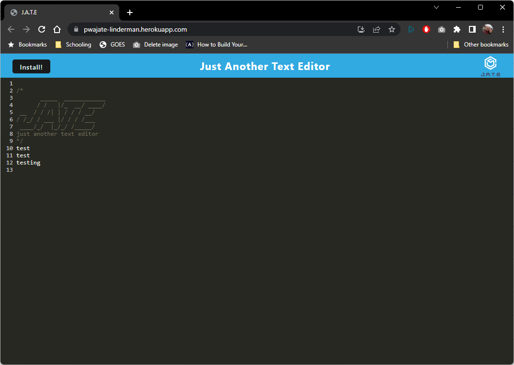

  

  
  

  

  
  ## Jerrod Linderman

  

  

  
  

  
  
  <h1 align="center">Badges</h1>
  

  

  
  

  
  
  
  

  

  
  <h1 align="center">
  
  Progressive Web App</h1>

  
  
  ## Table of Contents:
  1. [Description](#description)
  2. [Installation](#installation)
  3. [Usage](#usage)
  4. [How To Contribute](#contribute)
  5. [license](#license)
  6. [Tests](#tests)
  7. [Github](#github)
  8. [Email](#questions)

  ## Description
  An application text editor app that allows for note taking and snippets to be usable while offline it is deployed through Heroku. 

  ## Installation
  git clone the repo to your machine, to use this application run the following command to install npm install.  then run the following command npm run start:dev 

  ## Usage
  npm run start then open http://localhost:3000/ to run the application on your loacal machine.

 
  ## Contribute
  
  [Contributor Covenant](https://www.contributor-covenant.org/)

  At this time owner is not accepting any contributions to this project.

  ## License

  Published under the [MIT](license.txt) License.
  

  Read More about the licence by clicking this Link: [MIT](https://opensource.org/licenses/MIT).
 

  ## Tests
  No test files 

  ## GitHub
  [nvmax](https://github.com/nvmax)

  ## Questions
  If you have any questions, please contact me by clicking the email link below:
  ### [nvmaxx@gmail.com](nvmaxx@gmail.com) 

 
